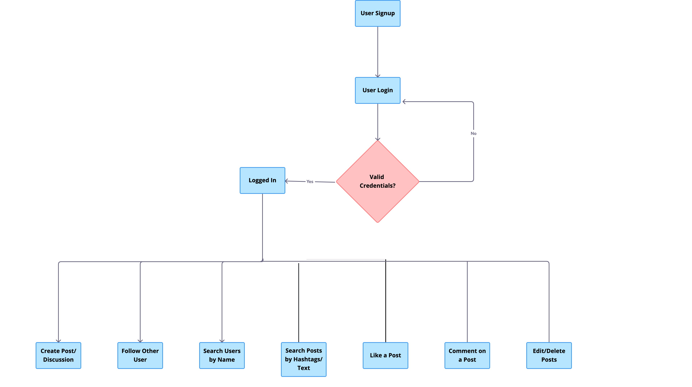

## Overview
This project aims to create users who can follow each other, post a discussion, and view, like, or comment on the other users' posts.

### Tech Stack
1. Python
2. FastAPI
3. Peewee
4. PostgreSQL

### How to Run
`uvicorn app:app --reload`

### Flow Diagram

### Database Table Definitions

1. **User**
   - `id`: Primary key, auto-generated unique identifier for each user.
   - `name`: Name of the user.
   - `mobile_no`: Mobile number of the user.
   - `email`: Email address of the user.
   - `password`: hashed password for login. 
   - `created_at`: Timestamp indicating when the user record was created.

2. **Discussion**
   - `id`: Primary key, auto-generated unique identifier for each discussion.
   - `user_id`: Foreign key referencing the user who posted the discussion.
   - `text`: Text content of the discussion.
   - `image`: Image associated with the discussion (optional).
   - `hashtags`: hashtags related to the discussion(optional).
   - `created_on`: Timestamp indicating when the discussion was created.

3. **Comment**
   - `id`: Primary key, auto-generated unique identifier for each comment.
   - `user_id`: Foreign key referencing the user who posted the comment.
   - `discussion_id`: Foreign key referencing the discussion to which the comment belongs.
   - `text`: Text content of the comment.
   - `parent_comment_id`: Optional foreign key referencing the parent comment for nested comments.
   - `created_at`: Timestamp indicating when the comment was created.

4. **Like**
   - `id`: Primary key, auto-generated unique identifier for each like.
   - `user_id`: Foreign key referencing the user who liked the post/comment.
   - `discussion_id`: Foreign key referencing the discussion that was liked (optional).
   - `comment_id`: Foreign key referencing the comment that was liked (optional).

5. **Follow**
   - `id`: Primary key, auto-generated unique identifier for each follow relationship.
   - `follower_id`: Foreign key referencing the user who is following.
   - `followee_id`: Foreign key referencing the user who is being followed.

### Important Note 
.env file contains :
1. Database url which must be created first on localhost.
2. Secret key for authentication which can be randomly generated.

